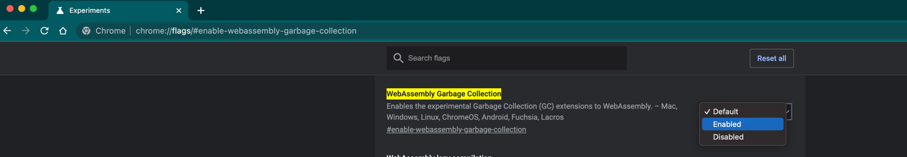

# Java hello world in a browser using Bytecoder

This sample leverages [bytecoder](https://github.com/mirkosertic/Bytecoder) to display a simple hello world in the HTML page.

It requires Wasm GC support and is tested only with Chrome. 
`WebAssembly Garbage Collector` flag ([chrome://flags/#enable-webassembly-garbage-collection](chrome://flags/#enable-webassembly-garbage-collection)) should be enabled as bellow.

